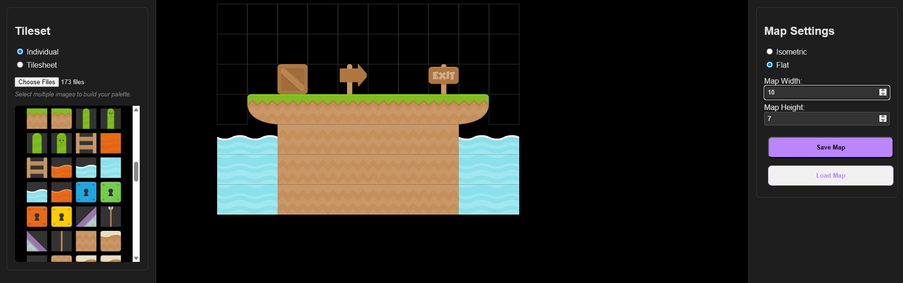

# TileScape: Isometric Map Editor



**TileScape** is a modern, web-based isometric map editor built to provide a premium and intuitive experience for creating 2.5D maps.

## Vibe Coded
This project was entirely **Vibe Coded** using **Gemini 3** and **Antigravity**. It demonstrates the power of agentic AI in building complex, interactive web applications from scratch, focusing on aesthetics ("vibes") and functionality.

## Features
- **Multi-Mode Support**: Switch between **Isometric** (2.5D) and **Flat** (Orthogonal) perspectives.
- **Flexible Import**: Import tilesets as individual images or a single tilesheet.
- **Advanced Interaction**:
    - **Drag-to-Paint**: Continuously place tiles by dragging.
    - **Smart Selection**: Scrollable tileset preview with precise selection.
    - **Pan & Zoom**: Middle-click to pan the canvas.
    - **Context Menu**: Right-click to clear tiles.
- **Data Persistence**: Automatically saves your map and settings to local storage.

## Tech Stack
- **Vite**: Fast build tool and dev server.
- **Vanilla JavaScript**: Core logic for maximum performance and control.
- **HTML5 Canvas**: High-performance rendering for the map and tilesets.
- **CSS3**: Modern styling with variables, glassmorphism, and dark mode.

## Getting Started

1.  **Clone the repository**:
    ```bash
    git clone https://github.com/LeePresswood/TileScape.git
    ```
2.  **Install dependencies**:
    ```bash
    npm install
    ```
3.  **Run the development server**:
    ```bash
    npm run dev
    ```
4.  **Build for production**:
    ```bash
    npm run build
    ```

## License
MIT
